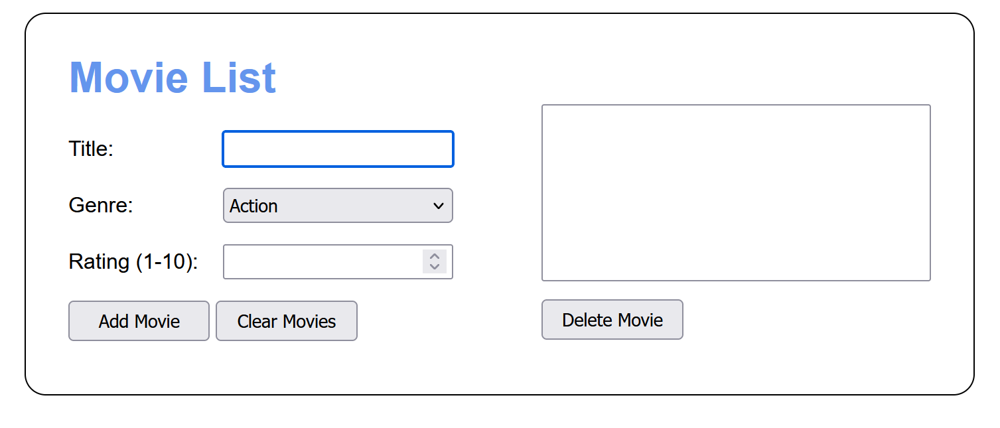
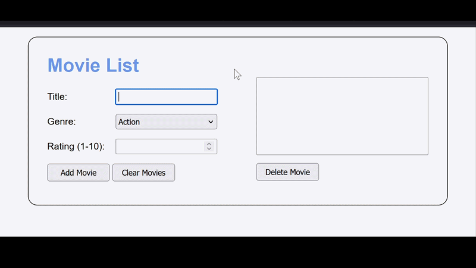
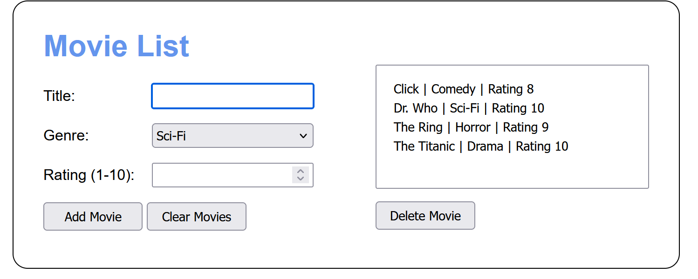
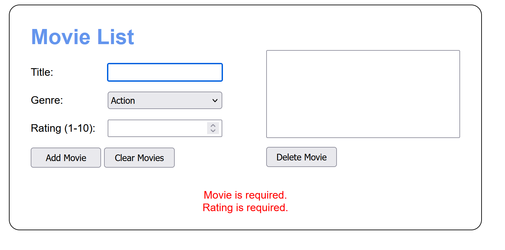

# 🎬 Movie Tracker

 

---

## 👤 Authors
Ben Stearns - [@bstearns07](https://github.com/bstearns07)  
Kaleb Aregay - [@Kalebk24](https://github.com/Kalebk24)

---

## 📑 Table of Contents
- [📌 Summary](#-summary)
- [⚙️ How It Works](#-how-it-works-)
- [🚀 Live Demo](#-live-demo)
- [✨ Features](#-features)
- [🧰 Tech Stack](#-tech-stack)
- [🧠 New-Topics Covered](#-new-topics-covered)
- [💻 Code Snippets](#-code-snippets)
- [📘 What We Learned](#-what-we-learned)
- [🖼 Screenshots](#-screenshots)

---

## 📌 Summary

The Movie Tracker app puts together the best of web storage, classes, modules, and data validation into
one nice package. Use this app to save all your favorite movies into your browsers storage. That way, if you
close your browser on accident it's all still there! Not too shabby if I do say so myself.

For full program details, refer to [Program Requirements](./assets/ProgramInstructions.pdf) 

---

## ⚙️ How It Works 
1. Open index.html to begin
2. Start adding movies by typing in their information in the form provided and click "Add Movie"
3. Your list of movies will begin being displayed in the text area provided
4. Don't like something in your list? Just click it with you mouse to highlight and press "Delete Movie" to remove it
5. Want to start over? Click "Clear Movies" to remove all movies you have saved

And that's all folks!

---

## 🚀 Live Demo

---
## ✨ Features
- Data Validation
- All movies are stored in your browser's Web Storage
- Output display of all your movies in storage
- "Add Movie" and "Clear Movies" buttons for adding a movie and clearing all movies from storage
- "Delete Movie" to remove whatever movie is highlighted from your list from web storage
- Class and module file directory structure

---

## 🧰 Tech Stack

### 🖥 Frontend
- HTML5 (Semantic Markup)
- CSS3 (Layout & Styling)
- Vanilla JavaScript (ES6+)

### 🧩 Core Concepts
- Class data structures
- Module Importing
- Web Storage
- DOM manipulation
- Data validation
- Data sorting

### 🛠 Development Tools
- GitHub version control
- WebStorm IDE

---

## 🧠 New Topics Covered
- Web Storage: a way of storing data in a web browser's memory as a JSON string
- Objects: a data structure collection of related properties and methods
- Classes: the blueprint for an object that allows for multiple instances to be instantiated
- Modules: files containing self-contained, reusable code that's kept out of global space. Only code that's needed is exposed to other parts of the application
- More advanced array method like .sort()

---

## 💻 Code Snippets
| Concept                      | Description                                                                                                                               |
|------------------------------|-------------------------------------------------------------------------------------------------------------------------------------------|
| `export default`             | Allows a module to export a single value (named or anonymous). Doesn't require curly braces when importing.                               |
| `Symbol.iterator`            | Defines how a class behaves during iteration (like `for...of` loops) by returning a generator or iterator.                                |
 | `import * as dom from "DOM"` | imports everthing in a module under an alias                                                                                              |
| `constructor()`              | creates an instance of an object                                                                                                          |          
| `sort(a,b)`                  | sorts an array by looping through each element, comparing that element to the next one, and swapping places depending on how they compare |                                                                                  |                                                                                                      |   

## 📘 What We Learned
There's a lot learned in this project. How you can work with array in JavaScript is completely different than any other language.
Methods like sort() and reduce() allow you to sort an array or reduce it to one value however you want. How these methods
work depends on the function you pass to them. This make JavaScript a very versitile language to use. 
 
Web storage is also a pivotal skill to learn in JavaScript. It allows you to store data in a web browser's storage
however long you like as a JSON string. You can then retrieve this data later to do things like repopulate fields in a 
form. Objects are also introduced here, which act as a collection of related properties and methods. 
 
Probably the biggest aspect of this program was the separation of code into different files, namely modules and class files.
Modules are files containing resusable code that focuses on one thing. These are typically variable and functions.
This code can then be exposed to other parts of your program to use, but only the parts you choose to. Everything else is
kept private and prevents polluting global space. Classes act as the blueprint for an object so you can be instantiated
as many times as you need. 
 
Finally there's importmapping, a short script defining the filepaths for all your classes and modules. That way, if these
paths were to ever change you only have to update these in your inportmap.

---

## 🖼 Screenshots

### 🖼 Default State

### 🖼 List State

### 🖼 Data Validation

---

⬆️ [Back to Top](#-movie-tracker)
